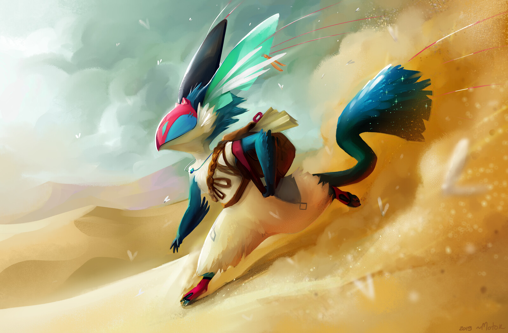

## Character and Species Personal Project

A simple scene artwork showing the main character of our story Haku crossing the desert to get to the city.

Domato capital city is set at past the biggest world desert and at the coast line. The travel to get there by land is cruel and avoided, exept of course, if youre a little determined domato.

The mask protect their sensitive eyes while the long whiskers and ears help on their localization. Design of Haku is based on a common house martin bird.

